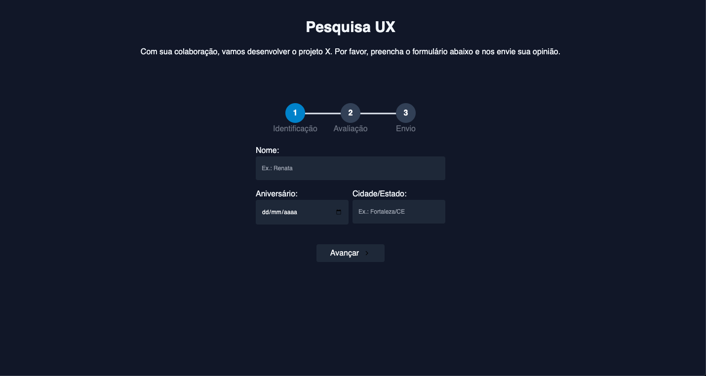

<div align="center" id="top">
  

&#xa0;

</div>

<h1 align="center">Formulario UX</h1>

<!-- Status -->

<!-- <h4 align="center">
	🚧  [texto] 🚀 Under construction...  🚧
</h4>
<hr> -->

<p align="center">
  <a href="#-sobre">Sobre</a> &#xa0; | &#xa0;
  <a href="#skateboard-funcionalidades">Funcionalidades</a> &#xa0; | &#xa0;
  <a href="#rocket-tecnologias">Tecnologias</a> &#xa0; | &#xa0;
  <a href="#white_check_mark-requisitos-para-rodar-a-aplicação">Requisitos</a> &#xa0; | &#xa0;
  <a href="#checkered_flag-iniciando">Iniciando</a> &#xa0; | &#xa0;
  <a href="#-configurações-adicionais-ao-projeto">Schemas</a> &#xa0; | &#xa0;
  <a href="#memo-licença">Licença</a> &#xa0; | &#xa0;
  <a href="https://github.com/andrelinos" target="_blank">Autor</a>
</p>

<br>

## 🧠 Sobre

O projeto é um formulário de pesquisa UX multietapas, utilizado para coletar feedback dos usuários sobre sua experiência com um produto ou serviço.

## 🛹 Funcionalidades

✔️ cadastrar as reposta do usúario\
✔️ Enviar os dados para o graphcms\
✔️ Aplicação responsiva

## 🚀 Tecnologias

Abaixo poderá ter acesso às principais tecnologias usadas neste projeto

- [NextJS](https://nextjs.org/)
- [TypeScript](https://www.typescriptlang.org/)
- [Graphcms](https://graphcms.com/)
- [Apollo Client](https://www.apollographql.com/)
- [GraphQL](https://graphql.org/)
- [Tailwind](https://tailwindcss.com/)
- [React-Icons](https://react-icons.github.io/react-icons/)

## ✅ Requisitos para rodar a aplicação

Antes de iniciar 🏁, você precisa ter [Git](https://git-scm.com) e [Node](https://nodejs.org/en/) instalado em seu sistema operacional.

## 🏁 Iniciando

```bash
# Clone este projeto
$ git clone https://github.com/joaotelesk/formulario-ux.git
# Acesse
$ cd formulario-ux
# Instale as dependências
$ yarn
# Execute o projeto
$ yarn start
# O projeto será inicializado em <http://localhost:3000>
```

## 📡 Configurações adicionais ao projeto

Para executar o projeto você precisa configurar também o graphcms e adicionar os itens para que consiga adicionar e ler itens na aplicação.

O link abaixo, tem o schema que você pode clonar e usar como base para entender o projeto:

- [https://app.graphcms.com/clone/70dfa4bd54ea415698f3e817d088677f?name=New](https://app.graphcms.com/clone/970dfa4bd54ea415698f3e817d088677f?name=New)

### No esquema você pode adicionar os itens para listá-los

- FormUser

## 📝 Licença

Este projeto está sob licença MIT. Para mais informações acesse [LICENSE](LICENSE.md).

Feito com 💜 por <a href="https://github.com/joaotelesk" target="_blank">João Teles</a>

&#xa0;

### Vamos nos conectar?

- [instagram](https://www.instagram.com/jaootelesk)
- [linkedin](www.linkedin.com/in/joaotelesk)
- [github](https://github.com/joaotelesk)

<br />
<br />
<a href="#top">Voltar ao topo</a>
